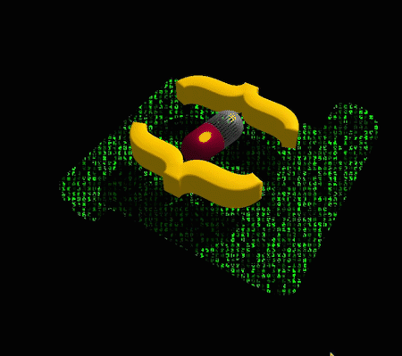

# Three.js Matrix Shader Effect Demo



The demo page:
https://designquest.com.hk/demo/threejs/matrix/

Apply the Matrix shader effect to my ThreeJS project.\
Thanks for the shader code by @patriciogv:\
https://thebookofshaders.com/edit.php#08/matrix.frag

and the ThreeJS course of [three.js journey](https://threejs-journey.xyz/) by @brunosimon

## Issue
The shader code does not work on ios!

## Setup
Download [Node.js](https://nodejs.org/en/download/).
Run this followed commands:

``` bash
# Install dependencies (only the first time)
npm install

# Run the local server at localhost:8080
npm run dev

# Build for production in the dist/ directory
npm run build
```
